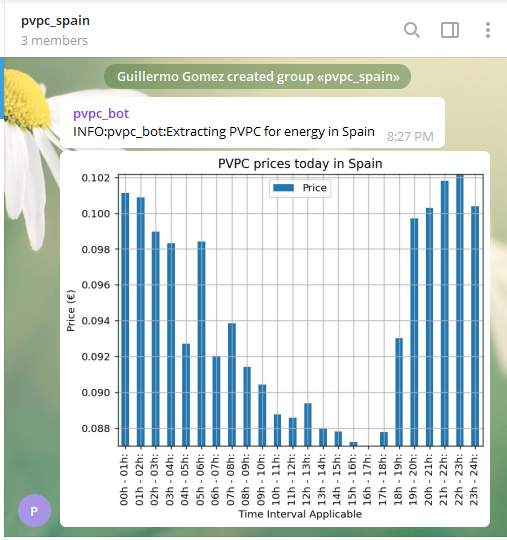
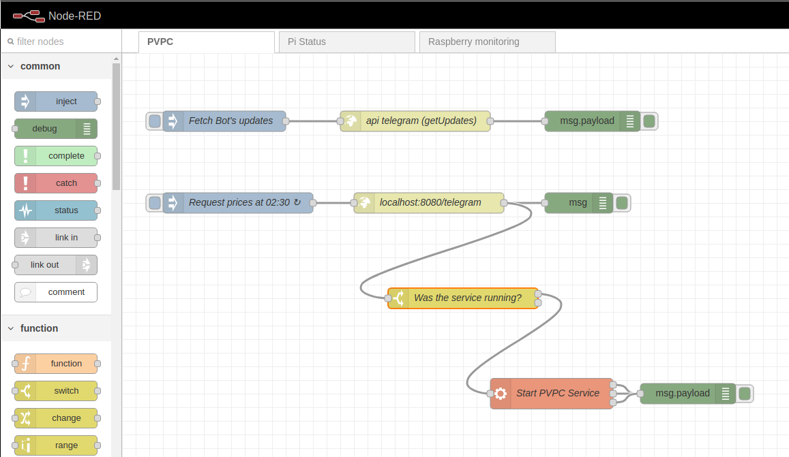

# pvpc_to_telegram
Telegram Bot that sends energy prices according to the PVPC webpage. Updates are sent at 02:30 of each day day with the 
prices per hour in the form of a barchart. 

Subscribe at: https://t.me/info_pvpc_spain  




Current version of the app is deployed in a Raspberry pi 4 and orchestrated via Node Red:
 

# Telegram package
This package makes use of a Telegram bot as handler for the standard logging library. In order to use this you will 
need to carry out some configurations outside the scope of this repository.

## How to create a Telegram Bot and link it to a chat/channel 
The process is very well documented online. I found this link (https://dev.to/rizkyrajitha/get-notifications-with-telegram-bot-537l)
very easy to follow.

1) Copy the Bot's token in tokens.json under the 'bot_token' object.
2) Copy the Chat's token in tokens.json under the 'chats_token' list. More than a single chat can be used seamlessly

Note: It was found required to have sent at least one message to the group/channel in order to fetch the id from 2)

## How to create a logging handler for a Telegram Bot
This section of the project is actually forked from https://github.com/dmitryikh/loggingbot with some fixes that I 
found required for my setup.

Clone my forked repo at least until PR is accepted
1) git clone https://github.com/Guillelerial/loggingbot.git

## Install and usage
Locally
````
pip install -r requirements.txt
pip install .
python3 -u pvpcservice/rest_manager.py
````
Container
````
bash deploy.exe
````
If required, start fresh restarting Docker desktop and running
````
docker rm $(docker ps -a -q) -f
docker rmi $(docker images -a -q) -f
````

Then access ````http://localhost:8080/ui```` to use the endpoints.
1) ````\telegram\```` Paste tokens.json contents as payload
2) ````\v2\prices\```` Will return a NGSI-v2 object describing prices for today
# Roadmap

~~1) Pending to add color to graph.~~

~~2) Pending to decide how to make the code run automatically every midnight~~ --> Node-red microservice

3) Fully integrate NGSI-v2 format

4) Parametrize the date for which prices are returned

5) Migrate to a https://www.esios.ree.es/es/pvpc to access to data at 20:30 of the day before

6) Integrate with FIWARE QuantumLeap and plot prices in Grafana

